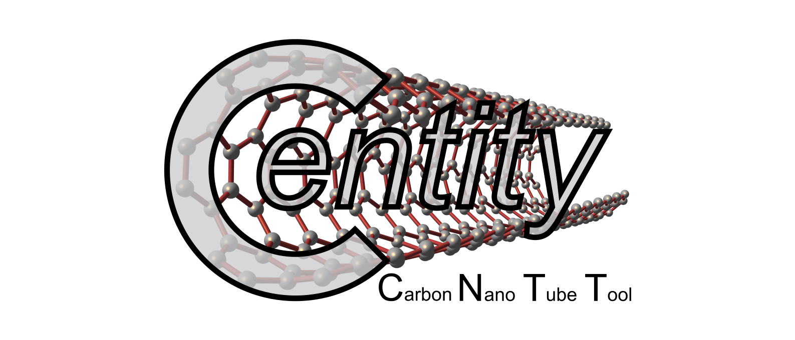

# CNTT

[](https://github.com/t3n0/cntt/releases/latest)
[](https://github.com/t3n0/cntt/releases/latest)
[](https://github.com/t3n0/cntt/releases/download/v0.2/cntt-v0.2.zip)
[](https://www.gnu.org/licenses/gpl-3.0)



**CNTT**, also spelled **C-entity**, is an utility to compute, display and manipulate electronic and optical properties of single-walled carbon nanotubes (SWCNTs). CNTT is an acronym for **Carbon NanoTube Tool**.

At the current state of developement, this tool is capable of computing the electronic and excitonic band structure of SWCNTs, along with the electron and exciton Density of States (DOS). This is done in a very efficient way by exploiting the **helical symmetry** of SWCNTs. Results are then displayed in helical coordinates. In this way, most of the optical properties of SWCNTs become apparent by simply inspecting the [helical bandstructure](./docs/readme-pics/cnt(4,2).png).

## Installation

Simply download [.zip file](https://github.com/t3n0/cntt/releases/download/v0.2/cntt-v0.2.zip), extract it at your favourite location and run
```
pip install .
```
This will install the system-wide command `cntt` and the python package `cntt`.

## Usage (1): command line

For a basic usage of the tool, simply type in the terminal
```
cntt 4 2
```
This will display:
- the linear and helical band structure of a [(4,2) single-walled carbon nanotube](./docs/readme-pics/cnt(4,2).png),
- the (singlet, bright and dark) exciton energy dispersions,
- electron and exciton DOS,
- and the most important physical parameters, unit cells and Brillouin zones.

Also, typing `cntt -h` provide a help dialoge for advanced usage.

## Usage (2): package

From a pyhton interpreter, import the base `Swcnt` class. For a basic usage, just copy the following snippet:
```
from cntt.swcnt import Swcnt

mycnt = Swcnt(4,2)

mycnt.calculateCuttingLines()

# tight-binding calculation with onsite energy 3.0eV and Fermi level at 0.0eV
mycnt.calculateElectronBands('TB', 'TB', 'lin', gamma = 3.0, fermi = 0.0)
mycnt.calculateElectronBands('TB', 'TB0', 'hel', gamma = 3.0, fermi = 0.0)

# same as above, but with different fermi level
mycnt.calculateElectronBands('TB', 'TB1', 'hel', gamma = 3.0, fermi = 1.5)

mycnt.calculateKpointValleys()

# excitons generated by the two different underlying electron structures
mycnt.calculateExcitonBands('EM','TB0', deltaK=10, bindEnergy=0.2)
mycnt.calculateExcitonBands('EM','TB1', deltaK=10, bindEnergy=0.1)

mycnt.calculateDOS('electron')
mycnt.calculateDOS('exciton')

mycnt.plot()
```
The above code produces the following plot

fermi.png)

## Support

For any problems, questions or suggestions, please contact me at tenobaldi@gmail.com.

## Roadmap

Currently, this project provides:
 - plotting the unit cells in three different configurations (the cnt supercell N-atom flake, the linear 2-atom cell and the helical 2-atom cell);
 - visualizing the corresponding graphene-like Brillouin zones;
 - computing and displaying the carbon nanotube band structure from the tight-binding zone-folding approximation;
 - computing and displaying the dispersion relation of bright and dark singlet excitons;
 - computing and displaying the DOS of electron and excitons;
 - simultaneous band plotting for comparison;
 - basic doping capabilities (fermi level and binding energy can be tuned and will influence the exciton dispersion);

Future developments will include:
- DFT calculation of electronic bands;
- joint density of states (JDOS);
- improved tight-binding methods;
- phonon calculations;
- output of the 3D carbon atoms coordinates;
- exciton absorption spectrum;
- optical matrix elements;

## Authors and acknowledgment

The development of CNTT is proudly powered by [me](https://github.com/t3n0).
Also, please consider citing the relevant literature if you are going to use this tool:
 - [Carbon 186, 465-474 (2022)](https://doi.org/10.1016/j.carbon.2021.10.048)

## License

This program is free software: you can redistribute it and/or modify it under the terms of the GNU General Public License as published by the Free Software Foundation, either version 3 of the License, or (at your option) any later version.

This program is distributed in the hope that it will be useful, but WITHOUT ANY WARRANTY; without even the implied warranty of MERCHANTABILITY or FITNESS FOR A PARTICULAR PURPOSE.  See the GNU General Public License for more details.

You should have received a copy of the GNU General Public License along with this program.  If not, see <https://www.gnu.org/licenses/>.
