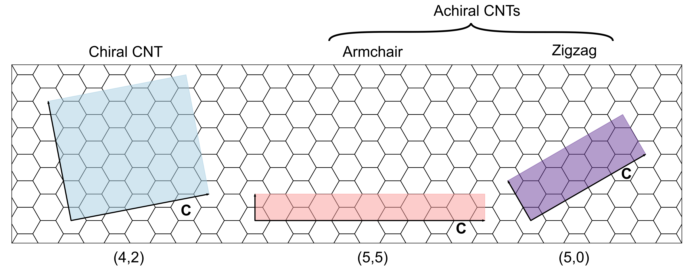
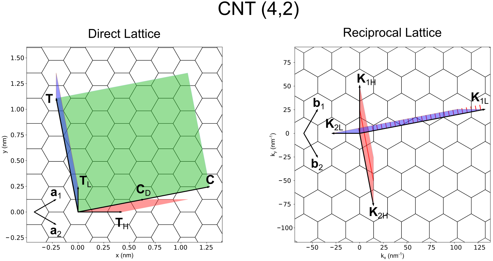

# Carbon Nanotubes

By Stefano Dal Forno.  
A collection of theoretical notes for the [C-entity package](https://github.com/t3n0/cntt).

***

Carbon nanotubes (CNTs) are structures consisting of a graphene sheet rolled up into a cylinder.
Generally, due to their small diameter compared to their length, CNTs are considered (quasi) one dimensional materials. Most of their properties are a consequence of the way the graphene sheet is rolled. We can have two types of CNTs (see Fig. 1):

- **achiral** CNTs (further subdivided in armchair or zigzag CNTs),
- and **chiral** CNTs.

Fig. 1: Three examples of the graphene sheets that generate chiral and achiral CNTs.

<br\><br\>

Every nanotube is uniquely defined by a pair of integer numbers $(n,m)$, $n \ge m$. These are the coefficients of the so-called *chiral* vector $ \mathbf{C} = n \mathbf{a}_1 + m \mathbf{a}_2$, where $\mathbf{a}_1$, $\mathbf{a}_2$ are the basis lattice vectors of the underlying graphene sheet.
The $\mathbf{C}$ vector runs over the circumference of the tube.
The chirality of CNTs is:

- $(n,n)$ armchair,
- $(n,0)$ zigzag,
- $(n,m)$ chiral.

## Basic geometrical properties of CNTs

For any given $(n,m)$ pair we define the following important quantities:

$$
\begin{equation}
\begin{split}
D &= \text{gcd}(n,m) \\
M &= (n - m) \, \text{mod} \, (3 D) \\
S &= (n - m) \, \text{mod} \, 3 \\
R &= \text{gcd}(2n+m, 2m+n) \\
N &= \frac{2 (n^2 + nm + m^2)}{R}
\end{split}
\end{equation}
$$

where the function $\text{gcd}(x,y)$ returns the greatest common divisor between $x$ and $y$. The above quantities are:

- $D$ counts the number of **unique rotations** (along the main axis) that leave the CNT the same. For example, the $(4,2)$ CNT in Fig. 1 has $D = 2$, which means that the CNT is not affected by rotations of 180 degrees.

- $M$ can be any value in the range $\{0, ..., 3D-1\}$. When $M=0$ the nanotube is **metallic type 2**, M2. This corresponds to a band structure where a single helical subband crosses both Dirac points.

- $S$ can be either 0, 1 or 2. If $M\ne0$, CNTs with $S=0$ are **metallic type 1**, M1. Otherwise, when $S = 1$ or $S = 2$ the CNT is **semiconducting type 1**, S1, or **semiconducting type 2**, S2, respectively.

- **Armchair** CNTs are always M2. **Zigzag** CNTs can be M1, S1 or S2. **Chiral** CNTs can be any type.

- $R$ is closely related to $D$, $M$ and $S$: if $M=0$ then $R = 3D$, otherwise $R=D$.

- finally, $N$ is the **number of hexagons** in the CNT unitcell. Since each hexagon contains 2 carbon atoms, the total number of carbon atoms per section of the tube is $2N$. For example, in the $(4,2)$ CNT above we have $N=28$, which means a total of $56$ carbon atoms.

## CNT real and reciprocal space lattices

To construct the real and reciprocal space lattices of a CNT we must start from the underlying graphene lattice.
To do this, we start by observing that the coloured shaded regions depicted in Fig. 1 define the **supercell** of the given CNT containing $2N$ atoms: this description is redundant.
Any atom in a given CNT can be constructed by an appropriate roto-translation operation performed on the underlying 2-atom graphene unit cell. To be more precise, any 2-atom unit cell can be chosen to construct the full CNT.
The procedure to build the entire CNT starting from a 2-atom unit cell goes under the name of **zone folding scheme**.
In the following we will study 2 different zone folding schemes:

- the **linear** construction,
- and the **helical** construction.

Fig. 2 shows both the linear and helical construction schemes for a $(4,2)$ CNT.

Fig. 2: (4,2) CNT real and reciprocal space lattices. a) Direct space lattice. In green is the 56-atom supercell, blue is the linear 2-atom unit cell, red is the helical 2-atom unit cell. b) Reciprocal space lattice. Blue and red are the linear and helical Brillouin zones. The supercell Brillouin zone is not drawn. The red solid lines are the electronic subbands. For the definition of the lattice vectors see the main text.

<br\><br\>

We start by defining the **graphene lattice vectors**:

$$
\begin{equation}
\begin{split}
\mathbf{a}_1 &= a_0 \big( \frac{\sqrt{3}}{2}, \frac{1}{2} \big), \quad
\mathbf{a}_2 = a_0 \big( \frac{\sqrt{3}}{2}, -\frac{1}{2} \big), \quad a_0 = 0.2461 \text{nm}, \\
\mathbf{b}_1 &= b_0 \big( \frac{1}{2}, \frac{\sqrt{3}}{2} \big), \quad
\mathbf{b}_2 = b_0 \big( \frac{1}{2}, -\frac{\sqrt{3}}{2} \big), \quad b_0=\frac{2\pi}{a_0}\frac{2}{\sqrt{3}}, \\
\end{split}
\end{equation}
$$

with $a_0 = \sqrt{3} a_C$, $a_0$ and $a_C$ being the **lattice constant** and distance bewteen carbon atoms.
Also, the **area** of the graphene unit cell and Brillouin zone is

$$
\begin{equation}
\begin{split}
A_{UC} &= \frac{\sqrt{3}}{2} a_0^2 , \quad A_{BZ} = \frac{\sqrt{3}}{2} b_0^2.
\end{split}
\end{equation}
$$

We construct the **translational vector** $\mathbf{T}$ by imposing the scalar product with $\mathbf{C}$ to zero.
The result reads:

$$
\begin{equation}
\begin{split}
\mathbf{T} = t_1 \mathbf{a}_1 + t_2 \mathbf{a}_2, \quad t_1 = \frac{2m+n}{R}, \quad t_2 = -\frac{2n+m}{R},
\end{split}
\end{equation}
$$

we chose $t_1$ and $t_2$ so that $\mathbf{T}$ points up.

The **circumference** and translational **length** of a tube are

$$
\begin{equation}
\begin{split}
C = |\mathbf{C}| = a_0 \sqrt{n^2 + nm + m^2}, \quad T = |\mathbf{T}| = \frac{\sqrt{3}}{R} C
\end{split}
\end{equation}
$$

The **area of the supercell** is given by

$$
\begin{equation}
\begin{split}
A_{SC} = |\mathbf{C} \times \mathbf{T}| =  \frac{n^2 + nm + m^2}{R} \sqrt{3} a_0^2.
\end{split}
\end{equation}
$$

The number of **hexagons** in a tube is the ratio between $A_{SC}$ and $A_{UC}$

$$
\begin{equation}
\begin{split}
N = \frac{A_{SC}}{A_{UC}} = \frac{2 (n^2 + nm + m^2)}{R}.
\end{split}
\end{equation}
$$

We now construct the **supercell Brillouin zone** by imposing

$$
\begin{equation}
\begin{split}
0 &= \mathbf{C} \cdot \mathbf{K}_2 = \mathbf{T} \cdot \mathbf{K}_1, \\
2 \pi &= \mathbf{C} \cdot \mathbf{K}_1 = \mathbf{T} \cdot \mathbf{K}_2.
\end{split}
\end{equation}
$$

We obtain

$$
\begin{equation}
\begin{split}
\mathbf{K}_1 = \frac{-t_2 \mathbf{b}_1 + t_1 \mathbf{b}_2}{N} , \quad K_1 = \frac{2 \pi}{C}, \\
\mathbf{K}_2 = \frac{m \mathbf{b}_1 -n \mathbf{b}_2}{N}, \quad K_2 = \frac{2 \pi}{T}.
\end{split}
\end{equation}
$$

$\mathbf{K}_1$ and $\mathbf{K}_2$ are the reciprocal lattice vectors of the **N-atom supercell**. This tiny BZ **cannot be superimposed** on the graphene one: we must construct a 2-atom BZ.

### Linear construction

The linear 2-atom unit cell and BZ (blue parallelogram in Fig. 2) is constructed by a specific choice of lattice vectors:

- the translational vector $\mathbf{T}$
- and any other vector $\mathbf{T}_L$ such that the area of the linear unit cell is one.

We can write

$$
\begin{equation}
\begin{split}
\mathbf{T} = t_1 \mathbf{a}_1 + t_2 \mathbf{a}_2, \\
\mathbf{T}_L = l_1 \mathbf{a}_1 + l_2 \mathbf{a}_2,
\end{split}
\end{equation}
$$

where $l_1$ and $l_2$ are integer coefficients to be determined. We then require that

$$
\begin{equation}
\begin{split}
|\mathbf{T} \times \mathbf{T}_L| = |t_1 l_2 - t_2 l_1| = 1.
\end{split}
\end{equation}
$$

There are infinite choices of $l_1$ and $l_2$ that satisfies the above equation (i.e. infinite slanted parallelograms with area 1). We pick solutions for which the area is positive (i.e. $\mathbf{T}$ rotates clockwise over $\mathbf{T}_L$) and

$$
\begin{equation}
\begin{split}
l_2 = \frac{1}{t_1} + \frac{t_2}{t_1}l_1,
\end{split}
\end{equation}
$$

with $l_1$ the smallest integer such that $l_2$ is also an integer. The **reciprocal lattice vectors** of the linear Brillouin zone are constructed in the usual way

$$
\begin{equation}
\begin{split}
0 &= \mathbf{T} \cdot \mathbf{K}{1L} = \mathbf{T}_L \cdot \mathbf{K}_{2L}, \\
2 \pi &= \mathbf{T} \cdot \mathbf{K}_{2L} = \mathbf{T}_L \cdot \mathbf{K}_{1L}.
\end{split}
\end{equation}
$$

We obtain

$$
\begin{equation}
\begin{split}
\mathbf{K}_{1L} = -t_2 \mathbf{b}_1 + t_1 \mathbf{b}_2 , \quad
\mathbf{K}_{2L} = l_2 \mathbf{b}_1 - l_1 \mathbf{b}_2.
\end{split}
\end{equation}
$$

As a final step, it is common to provide this result in terms of the supercell reciprocal vectors $\mathbf{K}_1$ and $\mathbf{K}_2$:

$$
\begin{equation}
\boxed{
\begin{split}
\mathbf{K}_{1L} &= N \mathbf{K}_1 , \\
\mathbf{K}_{2L} &= \alpha \mathbf{K}_1 + \mathbf{K}_2.
\end{split}}
\end{equation}
$$

with $\alpha = n l_2 - m l_1$.

### Helical construction

In a similar fashion, we construct the helical 2-atom unit cell (red parallelogram in Fig. 2) by selecting the following lattice vectors

- the rotational vector $\mathbf{C}_D = \mathbf{C}/D$
- and any other vector $\mathbf{T}_H$ such that the area of the helical unit cell is one.

The vector $\mathbf{C}_D$ is the minimal rotation that preserves the nanotube structure.

The procedure is the same as the linear construction.
We can write

$$
\begin{equation}
\begin{split}
\mathbf{C}_D = \frac{n \mathbf{a}_1 + m \mathbf{a}_2}{D}, \\
\mathbf{T}_H = h_1 \mathbf{a}_1 + h_2 \mathbf{a}_2,
\end{split}
\end{equation}
$$

where $h_1$ and $h_2$ are integer coefficients to be determined. We then require that

$$
\begin{equation}
\begin{split}
|\mathbf{C}_D \times \mathbf{T}_H| = \frac{1}{D}|n h_2 - m h_1| = 1.
\end{split}
\end{equation}
$$

There are infinite choices of $h_1$ and $h_2$ that satisfies the above equation (i.e. infinite slanted parallelograms with area 1). We pick solutions for which the area is positive (i.e. $\mathbf{C}_D$ rotates clockwise over $\mathbf{T}_H$) and

$$
\begin{equation}
\begin{split}
h_2 = \frac{D}{n} + \frac{m}{n}h_1,
\end{split}
\end{equation}
$$

with $h_1$ the smallest integer such that $h_2$ is also an integer.
The **reciprocal lattice vectors** of the helical Brillouin zone are

$$
\begin{equation}
\begin{split}
0 &= \mathbf{C}_D \cdot \mathbf{K}_{2H} = \mathbf{T}_H \cdot \mathbf{K}_{1H}, \\
2 \pi &= \mathbf{C}_D \cdot \mathbf{K}_{1H} = \mathbf{T}_H \cdot \mathbf{K}_{2H}.
\end{split}
\end{equation}
$$

We obtain

$$
\begin{equation}
\begin{split}
\mathbf{K}_{1H} = h_2 \mathbf{b}_1 - h_1 \mathbf{b}_2 , \quad
\mathbf{K}_{2H} = \frac{-m \mathbf{b}_1 + n \mathbf{b}_2}{D}.
\end{split}
\end{equation}
$$

Finally, it is common to provide this result in terms of the supercell reciprocal vectors $\mathbf{K}_1$ and $\mathbf{K}_2$:

$$
\begin{equation}
\boxed{
\begin{split}
\mathbf{K}_{1H} &= D \mathbf{K}_1 + \beta \mathbf{K}_2, \\
\mathbf{K}_{2H} &= -\frac{N}{D} \mathbf{K}_2
\end{split}}
\end{equation}
$$

with $\beta = t_1 h_2 - t_2 h_1$.

## CNT band structure in the zone-folding scheme

Now that we have defined the linear and helical 2-atom unit cells, we are ready to construct the band structure if any CNT in the zone-folding scheme.
We first notice that all CNTs are (obviously) invariant under a 360 rotation. This means that the wavefunction must obey the following **boundary conditions**

$$
\begin{equation}
\begin{split}
\Psi_{\mathbf{k}}(\mathbf{r}) = \Psi_{\mathbf{k}}(\mathbf{r} + \mathbf{C}),
\end{split}
\end{equation}
$$

where $\mathbf{k}$ is a wavevector that lives on the two dimensional graphene Brillouin zone.
The **Bloch theorem** also applies

$$
\begin{equation}
\begin{split}
\Psi_{\mathbf{k}}(\mathbf{r} + \mathbf{C}) = e^{i\mathbf{k} \cdot \mathbf{C}} \Psi_{\mathbf{k}}(\mathbf{r}).
\end{split}
\end{equation}
$$

If we combine the above expressions we obtain

$$
\begin{equation}
\begin{split}
\mathbf{k} \cdot \mathbf{C} = 2 \pi \, p,
\end{split}
\end{equation}
$$

with $p$ an integer number. In particular, any vector in the form

$$
\begin{equation}
\begin{split}
\mathbf{k} = p \mathbf{K}_1 + \lambda \mathbf{K}_2
\end{split}
\end{equation}
$$

with integer $p$ and continuous $\lambda$ satisfies the above boundary conditions.
This restricts $\mathbf{k}$ to a subset of **parallel equidistant cutting lines** that spans the entire graphene BZ.
The **allowed values** for $p$ and $\lambda$ depend on the choice of the unit cell contruction: linear or helical.
We can write

$$
\begin{equation}
\boxed{
\begin{split}
\text{Linear BZ:} \quad \mathbf{k} &= \tilde\mu \mathbf{K}_{1} + k \mathbf{K}_{2}, \quad \tilde\mu \in [0, ..., N-1], \quad k \in [0, 1] \\
\text{Helical BZ:} \quad \mathbf{k} &= \frac{\mu}{D} \mathbf{K}_{1H} + \tilde k \mathbf{K}_{2H}, \quad \mu \in [0, ..., D-1], \quad \tilde k \in [0, 1]
\end{split}}
\end{equation}
$$

The above two expressions are the definitions of the red solid lines in Fig. 2b. They represent the cutting lines over which one can obtain the band structure of any CNT starting from the band structure of graphene.

Finally, in the following we list some of the most important properties of the linear and helical zonefolding schemes:

- $\mu$ and $k$ are the angular momentum and the linear momentum quantum numbers. They represent **pure rotations and translations** of the system.
- $\mu$ and $k$ are **conserved quantities**. This means that when we move out of the first BZ to a nearby BZ, the values of $\mu$ and $k$ stay the same.
- on the other hand, $\tilde \mu$ and $\tilde k$ are called **quasi** angular and linear momentum quantum numbers. They are not associated with pure rotations and translations but instead they are the projection of $\mu$ and $k$ on the screw axis.
- $\tilde \mu$ and $\tilde k$ are **not conserved**. When we move out of the first BZ, $\tilde \mu$ and $\tilde k$ must be brought back to the first BZ by an appropriate recirpocal lattice transaltion. The new values of $\tilde \mu$ and $\tilde k$ will be different in general.
- the linear scheme uses the pair $(\tilde \mu, k)$. Within this scheme $k$ is conserved, i.e. $k$ does not change if we change $\tilde \mu$. On the other hand, $\tilde \mu$ is not conserved: if we change $k$ and exit the first BZ, the new value of $\tilde \mu$ will be $\tilde \mu = \pm \alpha$ (see Fig. 2b, blue region).
- the helical scheme uses the pair $(\mu, \tilde k)$. If we change $\tilde k$ and move out of the BZ, we will be brought back to the same cutting line and $\mu$ will be conserved. On the other hand, if we change $\mu$ the value of $\tilde k$ will change to $\tilde k = \pm \beta K_2$ (see Fig. 2b, red region).

The very last expression is also called **orthogonal** or **perpendicular pseudo-momentum**

$$
\begin{equation}
\begin{split}
\Delta k_{\perp} = \beta K_2.
\end{split}
\end{equation}
$$

This represent the linear momentum delivered by a **perpendicular polarized photon**.

### Final considerations

The choice to use either the linear or the helical scheme is arbitrary since both have pros and cons.
In my personal opinion, the **helical scheme is better**:

- there is a fewer number of subbands to manipulate (i.e. $D << N$ in general).
- the width of the helical BZ is bigger (i.e. $K_{2H} >> K_2$). This has the benefit that scattering between particles with large momentum (being them electrons, holes, excitons or phonons) are easier to deal with.
- using the pure angular momentum $\mu$ has the advantage to simplify most selection rules.
- in cases of transitions with different $\mu$, the only care that must be taken is adding the corresponding $\Delta k_{\perp}$ to preserve the linear momentum.
