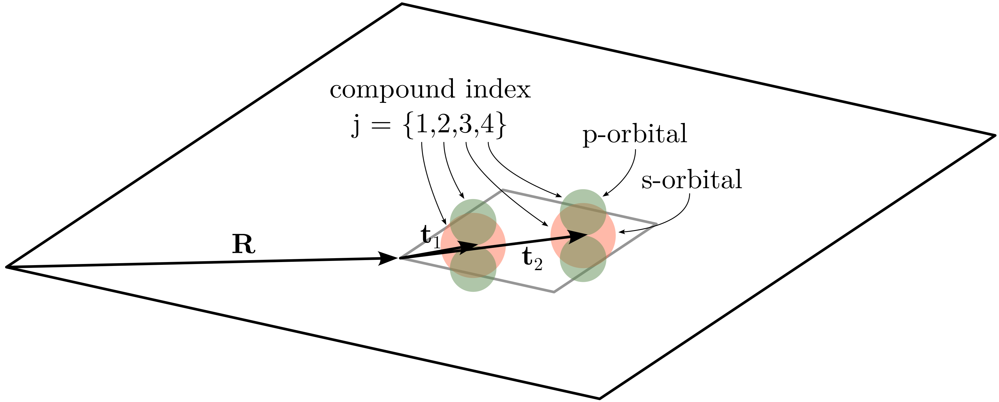

# Tight-binding (TB) approximation

A collection of [theoretical notes](./README.md) for the [C-entity package](https://github.com/t3n0/cntt).  
By Stefano Dal Forno.

***

## Atomic and crystal Hamiltonians

We have some atomic, single-particle Hamiltonian $H_{at}$ and its solutions

$$
\begin{equation}
\begin{split}
H_{at} &= -\frac{\hbar^2 \nabla^2}{2m} + V(\mathbf{r}), \quad H_{at} \phi_{\alpha} = \epsilon_{\alpha} \phi_{\alpha},
\end{split}
\end{equation}
$$

where $\alpha$ labels the orbitals and the energies of the isolated atom.

We want to find the solutions of the crystal made of the selected atoms. The crystal Hamiltonian $H_{cry}$ is

$$
\begin{equation}
\begin{split}
H_{cry} &= -\frac{\hbar^2 \nabla^2}{2m} + \sum_{\mathbf{R}} V(\mathbf{r}-\mathbf{R}), \quad H_{cry} \psi_{n\mathbf{k}} = E_{n\mathbf{k}} \psi_{n\mathbf{k}},
\end{split}
\end{equation}
$$

where $n$ labels the bands and $\mathbf{k}$ is the usual crystal momentum quantum number.

Before proceeding, we define the following notation:

- the crystal is made of $N$ unit cells,
- each unit cell is labelled by the lattice vector $\mathbf{R}$,
- each unit cell has a number of atomic sites labelled $\mathbf{t}_1$, $\mathbf{t}_2$, ...,
- each atomic site has a number of orbitals $\alpha$.

To uniquely indentify a given orbital, on a given site, in a given unit cell we introduce the following compound notation

$$
\begin{equation}
\phi_{\alpha}(\mathbf{r} - \mathbf{R} - \mathbf{t}_ {\mu}) = \phi_j(\mathbf{r} - \mathbf{R})
\end{equation}
$$

where $j=\{\alpha \mu\}$ is a compound index that counts all orbitals on all atoms in a given unit cell, see Fig. 1.

Fig. 1: Example of a unit cell with two sites and two orbitals per site. The j index runs from 1 to 4 and uniqeuly indentifies all the orbitals.

<br\><br\>

We are now ready to construct the **eigenbasis** of the crystal as linear combinations of atomic orbitals: we make the following **ansatz**

$$
\begin{equation}
\begin{split}
\chi_{j \mathbf{k}}(\mathbf{r}) = \sum_{\mathbf{R}} \lambda_{j}^{\mathbf{k}}(\mathbf{R}) \phi_{j}(\mathbf{r}-\mathbf{R}).
\end{split}
\end{equation}
$$

By enforcing the **Bloch theorem**

$$
\begin{equation}
\begin{split}
\chi_{j \mathbf{k}}(\mathbf{r} + \mathbf{R}) =  e^{i\mathbf{k} \cdot \mathbf{R}} \chi_{j \mathbf{k}}(\mathbf{r}),
\end{split}
\end{equation}
$$

we obtain a constrain for the $\lambda$ coefficients

$$
\begin{equation}
\lambda_{j}^{\mathbf{k}}(\mathbf{R}) = e^{i\mathbf{k} \cdot \mathbf{R}} \lambda_{j}^{\mathbf{k}}(0).
\end{equation}
$$

The crystal eigenbasis becomes

$$
\begin{equation}
\boxed{
\chi_{j \mathbf{k}}(\mathbf{r}) = \lambda_{j}^{\mathbf{k}} \sum_{\mathbf{R}} e^{i\mathbf{k} \cdot \mathbf{R}} \phi_{j}(\mathbf{r}-\mathbf{R})},
\end{equation}
$$

where we wrote $\lambda_{j}^{\mathbf{k}}(0) = \lambda_{j}^{\mathbf{k}}$ for simplicity.

The above equation has the following properties

- satisfies the Bloch theorem,
- it forms a complete basis set, although **non-orthonormal** (as we will see below),
- $j$ labels the bands, i.e. the **number of orbitals** and **the number sites** equals the **number of bands** that we obtain,
- the **normalisation** coefficients $\lambda_{j}^{\mathbf{k}}$ must be determined by imposing $1 \equiv \langle \chi_{j \mathbf{k}}|\chi_{j \mathbf{k}} \rangle$.

Finally, we have some arbitrariness in choosing $\lambda_{j}^{\mathbf{k}}$. This is because every wavefunction is **gauge invariant** under a unitary rotation by a total phase factor. In the literature, we will find two conventions:

- **Convention 1**: we explicitly multiply the phase factor corresponding to the atomic site $e^{i \mathbf{k} \cdot \mathbf{t}_ {\mu}}$
- **Convention 2**: the atomic site phase factor is not considered.

In this notes we adopt **Convention 1**: the Bloch basis becomes

$$
\begin{equation}
\boxed{
\chi_ {j \mathbf{k}}(\mathbf{r}) = \lambda_ {j}^{\mathbf{k}} \sum_ {\mathbf{R}} e^{i\mathbf{k} \cdot (\mathbf{R}+\mathbf{t}_ {j})} \phi_{j}(\mathbf{r}-\mathbf{R})}.
\end{equation}
$$

## Matrix elements of the Bloch basis

Let us define the following quantities

$$
\begin{equation}
\begin{split}
H^{\mathbf{k}}_ {ij} &= \langle \chi_{i\mathbf{k}} | H_{cry} | \chi_{j\mathbf{k}} \rangle, \\
S^{\mathbf{k}}_ {ij} &=  \langle \chi_{i\mathbf{k}} | \chi_{j\mathbf{k}} \rangle.
\end{split}
\end{equation}
$$

The above are respectively the **matrix element** of the crystal hamiltonian and the **overlap element** of the Bloch basis.

Let's carry out the calculation for $S^{\mathbf{k}}_ {ij}$

$$
\begin{equation}
\begin{split}
S^{\mathbf{k}}_ {ij} &= \langle \chi_{i \mathbf{k}}|\chi_{j \mathbf{k}} \rangle =
\int_{cell} \chi^{\ast}_ {i \mathbf{k}}(\mathbf{r}) ~ \chi_{j \mathbf{k}}(\mathbf{r}) d\mathbf{r} \\
&= \lambda_{i}^{\mathbf{k}{\ast}} \lambda_{j}^{\mathbf{k}} e^{i \mathbf{k} \cdot (\mathbf{t}_ {j} - \mathbf{t}_ {i})}
\sum_{\mathbf{R}, \mathbf{R}'}
e^{i\mathbf{k} \cdot (\mathbf{R} - \mathbf{R}')}
\int_{cell} \phi^{\ast}_ {i}(\mathbf{r} - \mathbf{R}') ~ \phi_{j}(\mathbf{r} - \mathbf{R}) d\mathbf{r},
\quad \mathbf{r} \rightarrow \mathbf{r} - \mathbf{R}' \\
&= \lambda_{i}^{\mathbf{k}{\ast}} \lambda_{j}^{\mathbf{k}} e^{i \mathbf{k} \cdot (\mathbf{t}_ {j} - \mathbf{t}_ {i})}
\sum_{\mathbf{R}, \mathbf{R}'}
e^{i\mathbf{k} \cdot (\mathbf{R} - \mathbf{R}')}
\int_{cell} \phi^{\ast}_ {i}(\mathbf{r}) ~ \phi_{j}(\mathbf{r} - (\mathbf{R} - \mathbf{R}')) d\mathbf{r},
\quad \mathbf{R} \rightarrow \mathbf{R} - \mathbf{R}' \\
&= \lambda_{i}^{\mathbf{k}{\ast}} \lambda_{j}^{\mathbf{k}} ~ N ~ e^{i \mathbf{k} \cdot (\mathbf{t}_ {j} - \mathbf{t}_ {i})}
\sum_{\mathbf{R}}
e^{i\mathbf{k} \cdot \mathbf{R}}
\int_{cell} \phi^{\ast}_ {i}(\mathbf{r}) ~ \phi_{j}(\mathbf{r} - \mathbf{R}) d\mathbf{r} \\
&= \lambda_{i}^{\mathbf{k}{\ast}} \lambda_{j}^{\mathbf{k}} ~ N ~ e^{i \mathbf{k} \cdot (\mathbf{t}_ {j} - \mathbf{t}_ {i})}
\sum_{\mathbf{R}}
e^{i\mathbf{k} \cdot \mathbf{R}}
S_{ij}(\mathbf{R}),
\end{split}
\end{equation}
$$

where $N$ is the number of unit cells in the whole crystal and $S_{ij}(\mathbf{R})$ is the **overlap integral** between orbitals:

$$
\begin{equation}
S_{ij}(\mathbf{R}) = \int_{cell} \phi^\ast_{i}(\mathbf{r}) \phi_{j}(\mathbf{r} - \mathbf{R}) d\mathbf{r}.
\end{equation}
$$

In a similar way we can carry out the calculation for $H^{\mathbf{k}}_ {ij}$

$$
\begin{equation}
\begin{split}
H^{\mathbf{k}}_ {ij} &= \langle \chi_{i \mathbf{k}}| H_{cry} |\chi_{j \mathbf{k}} \rangle \\
&= \quad ... \\
&= \lambda_{i}^{\mathbf{k}\ast} \lambda_{j}^{\mathbf{k}} N
e^{i \mathbf{k} \cdot (\mathbf{t}_ {j} - \mathbf{t}_ {i})}
\sum_{\mathbf{R}} e^{i\mathbf{k} \cdot \mathbf{R}}
H_{ij} (\mathbf{R})
\end{split}
\end{equation}
$$

where we carried the same substitutions as in the normalisation calculation.
The **hamiltonian matrix elements** are

$$
\begin{equation}
H_{i j} (\mathbf{R}) = \int_{cell} \phi^\ast_{i}(\mathbf{r}) H_{cry}(\mathbf{r}) \phi_{j}(\mathbf{r} - \mathbf{R}) d\mathbf{r}.
\end{equation}
$$

We obtained

$$
\begin{equation}
\boxed{
\begin{split}
H^{\mathbf{k}}_ {ij} &= \tilde N_{ij}^{\mathbf{k}} e^{i \mathbf{k} \cdot (\mathbf{t}_ {j} - \mathbf{t}_ {i})}
\sum_{\mathbf{R}} e^{i\mathbf{k} \cdot \mathbf{R}} H_{ij} (\mathbf{R}), \\
S^{\mathbf{k}}_ {ij} &= \tilde N_{ij}^{\mathbf{k}} e^{i \mathbf{k} \cdot (\mathbf{t}_ {j} - \mathbf{t}_ {i})}
\sum_{\mathbf{R}} e^{i\mathbf{k} \cdot \mathbf{R}} S_{ij} (\mathbf{R}),
\end{split}}
\end{equation}
$$

with $\tilde N_{ij}^{\mathbf{k}} = \lambda_{i}^{\mathbf{k}\ast} \lambda_{j}^{\mathbf{k}} N$.

The $S_{ij} (\mathbf{R})$ and $H_{ij} (\mathbf{R})$ parameters **define the physics** of our system: if we have $j = \{1 ... L\}$ orbitals displaced over $N$ unit cells, we must define a set of $L^2 \times N$ overlap and energy parameters (i.e. a lot of them).
Generally, as we will see later, what people do is limiting the above parameters to a subset of $L^2 \times N$ due to the fact that both $S_{ij} (\mathbf{R})$ and $H_{ij} (\mathbf{R})$ are fast approaching zero with increasing $\mathbf{R}$.

## Normalisation of the Bloch basis

We must **normalise** the Bloch basis. To do that, we impose $S^{\mathbf{k}}_ {jj} \equiv 1$ and we get an expression for the $\lambda$ coefficients

$$
\begin{equation}
|\lambda_{j}^{\mathbf{k}}|^2 = \frac{1}{N ~ \sum_{\mathbf{R}} e^{i\mathbf{k} \cdot \mathbf{R}} S_{jj}(\mathbf{R})}.
\end{equation}
$$

The above expression is purely real because $S_{jj}(\mathbf{R})$ is an even function of $\mathbf{R}.$
We can write

$$
\begin{equation}
\lambda_{j}^{\mathbf{k}} = \frac{1}{\sqrt{N ~ \sum_{\mathbf{R}} e^{i\mathbf{k} \cdot \mathbf{R}} S_{jj}(\mathbf{R})}}.
\end{equation}
$$

The above $\lambda_{j}^{\mathbf{k}}$ normalisation factor is a real number (but bear in mind that any wavefunction is always defined up to a total phase factor).
The **final expressions of the hamiltonian and overlap matrices** become

$$
\begin{equation}
\boxed{
\begin{split}
H^{\mathbf{k}}_ {ij} &= \frac{ e^{i \mathbf{k} \cdot (\mathbf{t}_ {j} - \mathbf{t}_ {i})}
\sum_{\mathbf{R}} e^{i\mathbf{k} \cdot \mathbf{R}} H_{ij} (\mathbf{R})}
{D^{\mathbf{k}}_ {ij}}, \\
S^{\mathbf{k}}_ {ij} &= \frac{ e^{i \mathbf{k} \cdot (\mathbf{t}_ {j} - \mathbf{t}_ {i})}
\sum_{\mathbf{R}} e^{i\mathbf{k} \cdot \mathbf{R}} S_{ij} (\mathbf{R})}
{D^{\mathbf{k}}_ {ij}},
\end{split}}
\end{equation}
$$

where the denominator $D^{\mathbf{k}}_ {ij}$ is given by

$$
\begin{equation}
D^{\mathbf{k}}_ {ij} =
\sqrt{ \sum_{\mathbf{R}} e^{i\mathbf{k} \cdot \mathbf{R}} S_{ii}(\mathbf{R}) }
\sqrt{ \sum_{\mathbf{R}} e^{i\mathbf{k} \cdot \mathbf{R}} S_{jj}(\mathbf{R}) }.
\end{equation}
$$

From the above expression, we see that the **normalisation of the Bloch basis** depends on the overlap integral $S_{jj}(\mathbf{R}).$
In general, orbitals belonging to different sites are **not guarantee to be orthogonal** (see Fig. 1), i.e. our Bloch basis is normalised but **not orthogonal**.
This translates into the fact that

$$
\begin{equation}
S^{\mathbf{k}} =
\begin{bmatrix}
    1 & S^{\mathbf{k}}_ {12} & \dots & & S^{\mathbf{k}}_ {1L}\\
    S^{\mathbf{k}}_ {21} & 1 & \\
    \vdots & & \ddots  & \\
    & & & 1 & \\
    S^{\mathbf{k}}_ {L1} &    &    & & 1
\end{bmatrix}
\end{equation}
$$

the $S$ matrix has all diagonal entries equal to $1$, and off-diagonal entries different from zero.

However, for very localised orbitals (i.e. orbitals which decay faster than the unit cell constant), we can assume the overlap integral to be negligible. This approximation is called **minimal TB approximation** and reads

$$
\begin{equation}
S_{ij}(\mathbf{R}) = \delta_{i j} \delta_{0 \mathbf{R}}
\end{equation}
$$

Within the minimal TB approximation, the $\lambda$ coefficients simply become $\lambda_{j}^{\mathbf{k}} = 1/\sqrt{N}$ and we can write

$$
\begin{equation}
\boxed{
\begin{split}
\chi_{j \mathbf{k}}(\mathbf{r}) &= \frac{1}{\sqrt{N}} \sum_{\mathbf{R}} e^{i\mathbf{k} \cdot (\mathbf{R} + \mathbf{t}_ {j})} \phi_{j}(\mathbf{r}-\mathbf{R}), \\
H^{\mathbf{k}}_ {ij} &= e^{i \mathbf{k} \cdot (\mathbf{t}_ {j} - \mathbf{t}_ {i})}
\sum_{\mathbf{R}} e^{i\mathbf{k} \cdot \mathbf{R}} H_{ij} (\mathbf{R}), \\
S^{\mathbf{k}}_ {ij} &= \delta_{ij}
\end{split}}
\end{equation}
$$

## Energies of a single Bloch state

We now focus our attention on a system with **just one orbital** $j$. The energy is

$$
\begin{equation}
\begin{split}
\varepsilon_{j \mathbf{k}} &=
\frac{\langle \chi_{j\mathbf{k}} | H_{cry} | \chi_{j\mathbf{k}} \rangle}
{\langle \chi_{j\mathbf{k}} | \chi_{j\mathbf{k}} \rangle} =
\frac{ H^{\mathbf{k}}_ {jj} } { S^{\mathbf{k}}_ {jj} }
\end{split}
\end{equation}
$$

We can carry on the calculation by noticing that $H_{cry}$ can be written as

$$
\begin{equation}
H_{cry} = H_{at} + \sum_{\mathbf{R} \ne 0} V(\mathbf{r} - \mathbf{R}) = H_{at} + W(\mathbf{r}).
\end{equation}
$$

Let's calculate the numerator $H^{\mathbf{k}}_ {jj}$

$$
\begin{equation}
\begin{split}
H^{\mathbf{k}}_ {jj} &= |\lambda_{j}^{\mathbf{k}}|^2 N
\sum_{\mathbf{R}} e^{i\mathbf{k} \cdot \mathbf{R}}
\left[
\int_{cell} \phi^\ast_{j}(\mathbf{r}) H_{at}(\mathbf{r}) ~ \phi_{j}(\mathbf{r} - \mathbf{R}) d\mathbf{r} +
\int_{cell} \phi^\ast_{j}(\mathbf{r}) W(\mathbf{r}) ~ \phi_{j}(\mathbf{r} - \mathbf{R}) d\mathbf{r}
\right] \\
&= |\lambda_{\alpha}^{\mathbf{k}}|^2 N
\sum_{\mathbf{R}} e^{i\mathbf{k} \cdot \mathbf{R}}
\left[
\epsilon_{j} \int_{cell} \phi^\ast_{j}(\mathbf{r}) ~ \phi_{j}(\mathbf{r} - \mathbf{R}) d\mathbf{r} +
\int_{cell} \phi^\ast_{j}(\mathbf{r}) W(\mathbf{r}) ~ \phi_{j}(\mathbf{r} - \mathbf{R}) d\mathbf{r}
\right] \\
&= |\lambda_{j}^{\mathbf{k}}|^2 N
\sum_{\mathbf{R}} e^{i\mathbf{k} \cdot \mathbf{R}}
\left[
\epsilon_{j} S_{jj}(\mathbf{R}) + W_{jj}(\mathbf{R})
\right] \\
&= \epsilon_{j} + |\lambda_{j}^{\mathbf{k}}|^2 N
\sum_{\mathbf{R}} e^{i\mathbf{k} \cdot \mathbf{R}} W_{jj}(\mathbf{R}) \\
&= \epsilon_{j} +
\frac{\sum_{\mathbf{R}} e^{i\mathbf{k} \cdot \mathbf{R}} W_{jj}(\mathbf{R})}
{ \sum_{\mathbf{R}} e^{i\mathbf{k} \cdot \mathbf{R}} S_{jj}(\mathbf{R}) }.
\end{split}
\end{equation}
$$

On the other hand, the denominator $S^{\mathbf{k}}_ {jj} \equiv 1$ because of the normalisation.
At last we obtain

$$
\begin{equation}
\boxed{
\begin{split}
H^{\mathbf{k}}_ {jj} &= \varepsilon_{j \mathbf{k}} = \epsilon_{j} +
\frac{\sum_{\mathbf{R}} e^{i\mathbf{k} \cdot \mathbf{R}} W_{jj}(\mathbf{R})}
{ \sum_{\mathbf{R}} e^{i\mathbf{k} \cdot \mathbf{R}} S_{jj}(\mathbf{R}) }, \\
S^{\mathbf{k}}_ {jj} &= 1.
\end{split}}
\end{equation}
$$

The above equations show that the **diagonal of the Hamiltonian matrix** equals some energy $\varepsilon_{j \mathbf{k}}$. These energies are given by a first order term equal to the energy of the atomic orbital $\epsilon_{j}$, plus a correction that depends on the overlap integrals $W_{jj}(\mathbf{R})$ and $S_{jj}(\mathbf{R})$.
Similarly, all the diagonal entries of overlap matrix are equal to unity.

We can further simply the expression of the energy using the **minimal TB approximation**. This becomes

$$
\begin{equation}
\boxed{
\varepsilon_{j \mathbf{k}} = \epsilon_{j} +
\sum_{\mathbf{R}} e^{i\mathbf{k} \cdot \mathbf{R}} W_{jj}(\mathbf{R})}.
\end{equation}
$$

In general, the $W_{jj}(\mathbf{R})$ coefficients are never calculated directly. In most TB models $W_{jj}(\mathbf{R})$ are given as input and are fitted to replicate experimental or DFT results.
Moreover, these matrix elements decay very rapidly with the distance $\mathbf{R}$. This implies that only a small number of lattice vectors $\mathbf{R}$ are needed to achieve convergence. A common approach is to perform the summation only over the **first nearest neighbors** of the atom.

$$
\begin{equation}
\varepsilon_{j \mathbf{k}} = \epsilon_{j} +
\sum_{\mathbf{R} \in \text{NN}} e^{i\mathbf{k} \cdot \mathbf{R}} W_{jj}(\mathbf{R}).
\end{equation}
$$

## Linear combination of Bloch states

Untilnow, we calculated the energy of a single Bloch state. This corresponds to the **very unrealistic case** of a unit cell with just one orbital.
Let us suppose we have $L$ orbitals, i.e. $j = \{1, 2, 3, ..., L\}$.
In this case, we must construct the wavefunction as a **linear combination of Bloch basis functions**.
This becomes

$$
\begin{equation}
\psi_{n\mathbf{k}} (\mathbf{r}) = \sum_{j} C_{j \mathbf{k}}^n \chi_{j \mathbf{k}}(\mathbf{r}).
\end{equation}
$$

Now $\psi_{n\mathbf{k}} (\mathbf{r})$ is the single-particle wavefunction of the crystal, with $n$ band number and $\mathbf{k}$ crystal momentum. We start by computing the energies

$$
\begin{equation}
E_{n\mathbf{k}} = \frac{\langle \psi_{n\mathbf{k}} | H_{cry} | \psi_{n\mathbf{k}} \rangle}
{\langle \psi_{n\mathbf{k}} | \psi_{n\mathbf{k}} \rangle}
= \frac{ \sum_{ij} C_{i \mathbf{k}}^{n\ast} C_{j \mathbf{k}}^n H^{\mathbf{k}}_ {ij}}
{\sum_{ij} C_{i \mathbf{k}}^{n\ast} C_{j \mathbf{k}}^n S^{\mathbf{k}}_ {ij}}
\end{equation}
$$

To determine the coefficients $C^n_{j \mathbf{k}}$, we adopt the variational principle and set the energy derivative to zero

$$
\begin{equation}
\frac{E_{n\mathbf{k}}}{\partial C^{n\ast}_ {i \mathbf{k}}}
= \frac{ \sum_{j} C_{j \mathbf{k}}^n H^{\mathbf{k}}_ {ij}}
{\sum_{ij} C_{i \mathbf{k}}^{n\ast} C_{j \mathbf{k}}^n S^{\mathbf{k}}_ {ij}} -
\frac{ \sum_{ij} C_{i \mathbf{k}}^{n\ast} C_{j \mathbf{k}}^n H^{\mathbf{k}}_ {ij}
\sum_{j} C_{j \mathbf{k}}^n S^{\mathbf{k}}_ {ij} }
{\left( \sum_{ij} C_{i \mathbf{k}}^{n\ast} C_{j \mathbf{k}}^n S^{\mathbf{k}}_ {ij} \right)^2}
\equiv 0
\end{equation}
$$

The equation to solve is

$$
\begin{equation}
\sum_{j} C_{j \mathbf{k}}^n H^{\mathbf{k}}_ {ij} =
E_{n\mathbf{k}} \sum_{j} C_{j \mathbf{k}}^n S^{\mathbf{k}}_ {ij}
\end{equation}
$$

$$
\begin{equation}
\boxed{
\begin{split}
H^{\mathbf{k}} C^{n\mathbf{k}} = E_{n\mathbf{k}} S^{\mathbf{k}} C^{n\mathbf{k}}\\
\det \left( H^{\mathbf{k}} - E_{n\mathbf{k}} S^{\mathbf{k}} \right) = 0
\end{split}}
\end{equation}
$$

The above equation is a **generalised eigenvalue problem**. Solving this problem means finding the (eigenvector, eigenvalue) pairs $C^{n\mathbf{k}}$, $E_{n\mathbf{k}}$. We have the following

- $H^{\mathbf{k}}$ and $S^{\mathbf{k}}$ are $L \times L$ matrices which elements are $H^{\mathbf{k}}_ {ij}$ and $S^{\mathbf{k}}_ {ij}$, respectively,
- $C^{n\mathbf{k}}$ are the (unknown) column vector with $L$ elements. These are the coefficient of the expansion of the $\psi_{n\mathbf{k}}$ wavefunction,
- $n = \{ 1, 2, ..., L\}$ is the band index. $L$ orbitals generates $L$ bands,
- $E_{n\mathbf{k}}$ are the (unknown) energies,
- we have a different problem for every $\mathbf{k}$,
- if we invoke the minimal TB approximation $S^{\mathbf{k}} = \Bbb I$ and the problem becomes a regular eigenvalue problem $H^{\mathbf{k}} C^{n\mathbf{k}} = E_{n\mathbf{k}} C^{n\mathbf{k}}$.

## Periodic gauge in k-space
